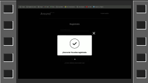
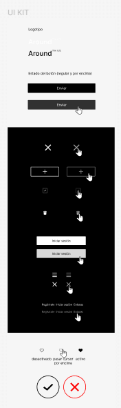
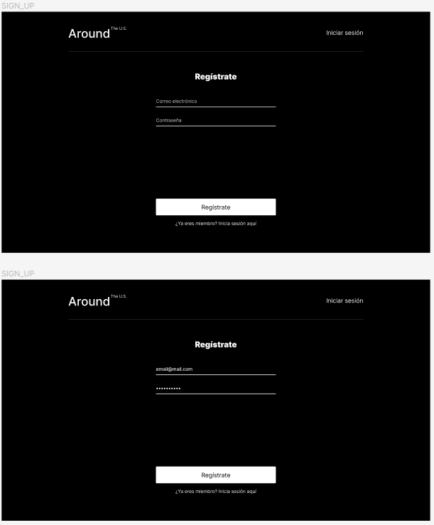
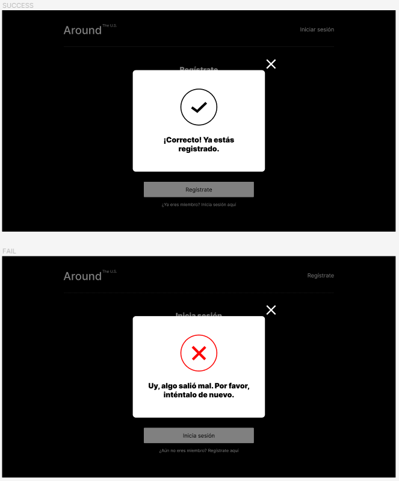
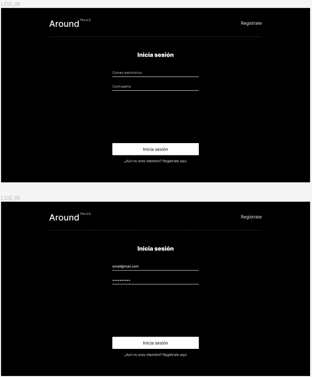
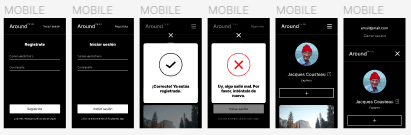

# Proyecto con React

## Descripción general

* Introducción
* Demo
* Figma
* Autorización
* Componentes
* Encabezado
* Compatibilidad
* Técnica
* CustomHook
* Contexts
* Resumen
* Link

## Introducción

El proyecto actual busca implementar el registro y la autorización.

## Demo

## Figma

Se tomaron los iconos svg del diseño proporcionados ahi como se muestra a continuación:

Esta es la interfaz del endpoint **/signup**. Aqui introduciremos un correo electronico no necesariamente auténtico para propósitos de la demo:

Aqui, saltaran estas ventanas modales al momento del exito (arriba) o fracaso (abajo) del registro:

La siguiente imagen corresponde al endpoint **/signin**. En este apartado se usará el correo y la contraseña previamente proporcionado en el registro:

Y por ultimo, se implemento un diseño adaptativo en los puntos de quiebre con los *media query*; y responsivo con la implementación de flexbox y grid en combinación:

## Autorización

Se creo un archivo en la carpeta de *utilities* con el nombre de auth.js encargado de mandar la solicitud de registro e ingreso a la aplicación; para guardar el token se usó el objeto **sessionStorage** en lugar de **localStorage** unicamente por los propositos de esta demo. Esta lógica esta importada en el archivo app.jsx en las funciones de **handleRegister** y **handleLogin**. 

La función **handleLogin** a su vez utiliza el método *push* de la función *history* para redirigir al usuario a la página principal que previamente se encontraba protegida por el componente **ProtectedRoute** responsable de dar acceso al contenido principal de la página o redireccionar al *endpoint* **/signin**.

## Componentes

Los componentes estrella para esta tarea son:

* Login: Este es un componente HOC (*High Order Component*) que transforma al componente **SignWithForm**. 

* Register: componente HOC. también transforma al componente **SignWithForm**.

* SignWithForm: trabaja con el metodo de useRef en su interior y como inputs estan anidados el de tipo *email y password*. Una vez presionado el botón de submit, resetea los valores. Ademas del componente **Form**, encontramos el componente **InfoToolTip** encargado de mostrar el mensaje de exito o fracaso de registro o ingreso.

* InfoToolTip: es un componente de ventana modal.

* ProtectedRoute: solo dará acceso al contendido a los usuarios autorizados.

## Encabezado

Dependiendo de la ruta donde se encuentre el usuario, este cambiará los links que mostrará con la ayuda de **useLocation** de la librería *react-router-dom*. Cuando el usuario se encuentra en la ruta main ("/") y el tamaño del *display port* es menor a 880px, aparecera un botón menu que renderizará u ocultará el correo con el que se ingreso y el link para cerrar sesión.

## Compatibilidad

Se verificó la implementación del diseño y de métodos en la pagina *can I use* en distintos navegadores, los principales fueron:

* Brave
* Chrome
* Edge
* Firefox
* Safari
* otros...

## Técnica

Esta demo es desarrollada con react-app.

### App

Cuenta con un *customHook* para las ventanas modales. Este entrega un objeto que contiene las propiedades seteadas a false. El segundo objeto es una función que abre (setea a true) la ventana modal recibiendo como paramentro un string con el nombre del modal; puede mejorarse creando un método para comprobar que se ha ingresado un nombre correcto que corresponde a alguno de las propiedades del objeto como argumento en la función. Y como último objeto, es otra función que cierra todas las ventanas (seteando todo a false).

Se hace uso de metodos como useState para actualizar la pagina con nuevos datos introducidos, useRef para que no afecte el renderizado pero se mantengan los datos a travez de la actulización de la pagina, el useCallback para poder trabajar con funciones creadas fuera de del metodo useEffect dentro de este efecto y useEffect para llamar a culquier api necesaria mas solo lo haga una vez al montarse el componente.

Se crea una función llamada **updateContent** que retorna un objeto con todas las funciones que se comunican con la api. La función **setFinally** ejecuta en su cuerpo una función para cerrar todas las ventanas modales y la función **setDelay** es pasado como argumento por los componentes hijos para hacer un callback y ejecutarse syncronamente. La implementación de **handleLike** fue con un propósito creativo para manejar funciones asyncronas y trabajar con doble hilo; de forma sencilla puede resolverse con un metodo map donde, con un condicional, va a buscar el id del objeto a cambiar. La función **handleDelete** busca el id de la carta y el algoritmo se detiene una vez que lo ecuentró; podría usarse el método filter de array pero este itera sobre todo el array.

### Card

El componente al ser usado en el cuerpo de un map para recrear una lista, se aprovecha la propiedad key que verifica con el Dom Virtual para posteriormente actualizar la única carta que tenga actualización. 

Importa el contexto de *CurrentUserContext* y se destructura para hacer uso de *userId*, a su vez, también se destructura data para facilitar la aplicacion de botones, conteos de likes, nombre, dueño de la carta, etc. 

Las funciones de card llaman a las funciones declaradas en app, **handleClick** y **handleDelete** hacen uso de **openPopupCard** que verifica en su cuerpo si se esta pasando un string o un objeto para disernir que modal abrir. En cuanto a **handleLikeClick** hace una actualización del contenido por lo tanto llama a **onUpdate**; como no necesita hacer otras acciones que requieren un *delay*, no se pasa un callback como argumento; y se accede a la propiedad de **handleLike** que recibe dos argumentos.

### Context

Este componente es un emboltorio de todos los contextos que se declaran en el cuerpo de app.jsx

### DeletePopup

El componente transforma al PopupWithForm y como no tiene **Childrens**, el botón siempre permanece activo.

### EditAvatarPopup

El componente usa el mismo componente de arriba, utiliza useRef para el input que pasa, aprovecha **useContext** de **PopupOpenContext** destructurando avatar, tiene un HOF (high order función) que se llama **handleSubmit** para trabajar con **setDelay** y **onUpdate**.

### EditProfilePopup

El componente usa PopupWithForm, pasa dos elementos input, utiliza useState para cada input, useRef para recuperar el mensaje de error del input si se le necesita, emplea useContext para el usuario y y la ventana modal edit, se emplea useEffect para actualizar los campos del formulario que se reciben de la api (podria emplearse "key" para destruir y reconstruir el componente), una función **handleChange** que reconoce el nombre del input y asigna la actualización del campo controlado, también posee un handleSubmit con las mismas funciones internas pero personalizadas diferente para el uso de este componente.

### Footer

Contiene mi nombre como autor del proyecto.

### Form

Reconoce si hay componentes hijos para decidir si habilitar/deshabilitar el botón para el envío, este valor es pasado al momento de declarar useState y también se usa en el segundo argumento en el envio. Tiene la función **handleValidation** para habilitar el botón si todos los campos son válidos. La función **handleSubmit** previene el comportamiento por defecto del botón submit, además, pasa al componente padre el argumento evento y la función que resetea el comportamiento del botón. Este mismo formulario es el responsable de renderizar la pregunta al final, despues de la pregunta.

### Header

Utiliza **useLocation** para destructurar **pathname** que se necesita para cambiar el link o menu que se mostrará dependiendo de la ubicación del usuario en la pagina. El botón que se renderiza en la página principal trabaja con el useState para mostrar u ocultar el contenido del correo y cerrar sesión por debajo de los 880px de tamaño de pantalla.

### ImagePopup

A traves de la información de referencia que se le proporciona, renderiza todas las tarjetas que fueron clickeadas en su imagen. Recibe el contexto de PopupOpenContext y CloseContext.

### InfoToolTip

El componente recibe tres diferentes contextos: PopupOpenContext, CloseContext y MssgContext. Tiene una constante que reconoce que tipo de mensaje recibe para renderizar el icono correcto. Se encarga de informar al usuario de su proceso de registro.

### Login

Cambia el comportamiento del componente SignWithForm. Le otorga un nombre, titulo, el parrafo (el link que debe mostrar en el campo de registro) y pasa la función para el registro.

### Main

Contiene todos los componentes que se renderizan en la pagina principal que incluye: Profile, Card y la mayoría de ventanas modales.

### PopupWithForm

Se encarga del comportamiento exclusivo de las vetanas modales en general, misma razon pasa un mod llamado *popup* para manejar los estilos. Tiene a su cargo el manejo de la referencia del botón, el contexto de cierre y la función de envio que modifica la animación que debe trabajar con el botón una vez presionado este.

### Profile

Tiene a su cargo abrir cualquiera de las tres ventanas modales. Se le pasa el contexto de CurrentUserContext destructurando name, about y avatar para moststrar en main. La función **handleCick** reconoce que botón fue precionado y abrira la ventana correspondiente.

### ProtectedRoute

Sencillamente se encarga de comprobar si existe *email* en *sessionStorage*. Da acceso al contenido principal de la pagina dependiendo si se inició sesión o no. De no tener autorización, redirigira a todos los usuarios a */signin*.

### Register

Moldea la forma de comportarse del componente SignWithForm. Tiene un link que se pasa a parrafo (*para*) encargado de renderizar la pregunta despues del botón. Le manda el nombre y titulo.

### ShowError

Recibe tres contextos: PopupOpen, Close y Mssg. Este componente se encuentra alojado en Main y saltara la ventana modal cada vez que un error ocurra. Más adelante se pretende mover esta ventana modal a App para mostrar todos los posibles errores que puedan llegar a ocurrir.

### SignWithForm

En su contenido estan los inputs debido a que son iguales en el login y en el registro. Su modificador se llama *section*. Se asegura que el contenido del botón sea igual al de titulo. La función **handleSubmit** recoge los valores de los campos para su envio, los resetea y reestablece el comportamiento del botón de envio.

Además del formulario, aquí se aloja el componente infoToolTip.

## CustomHook

### UseModal

Función que recibe strings de las ventanas que se hará responsable usando un parametro rest.

En su interior tiene un useState, se pasan los nombres de los modales con un reduce para convertirlo en un objeto configurandolo todo a false.

La función **openModal** se le pasa un useCallback. Responsable de cambiar a true la ventana correspondiente que se le pase como argumento. 

La función **closeAllModals** también tiene un useCallback. Deja a todas las propiedades el valor de false.

El useEffect tiene una constante que reconoce si el valor de alguna propiedad cambia a true. Si es asi, monta *addEventListener* para cerrar las ventanas correspondientes. Se asegura que esta acción sea limpia al no repetir el listener cada vez que se abre una ventana modal.

Tiene una función **setFalse** que se pasa como callback en las funciones correspondientes.

Para finalizar, retorna el objeto de los modales, la funcion de abrir y la funcion para cerrar. Se hace a travez de un array para personalizar los nombres si así se desea dentro del componente.

### UseSize

Función que recibe el valor primitivo número como parámetro. El useState decide entre dos strings (*desktop* y *other*). El useEffect tiene el método-controlador onresize de window; este puede mejorarse cambiándolo por un *addEventListener* lo cual sería también necesario un return para eliminar con *removeEventListener*, esta acción permitiría llamar useSize en cualquier componente.

## Contexts

La carpeta Contexts tiene en su interior: Close, CurrentUser, Mssg y PopupOpen.

## Resumen

Este proyecto se ha refactorizado con respecto a su antecesor automatizando ciertas funciones que aun pueden seguirse mejorando como se menciona en el apartado de técnica en su respectivo componente. A mostrado ser bastante adaptativo con respecto al crecimiento del proyecto. Aspectos importantes que se deben manejar aqui en la autorización, es que los datos deben ser tratados desde las cookies en los sieguientes trabajos del mismo para disminuir las vulnerabilidades.

## Link

[Pagina web](https://wlfernando.github.io/web_project_around_auth/)